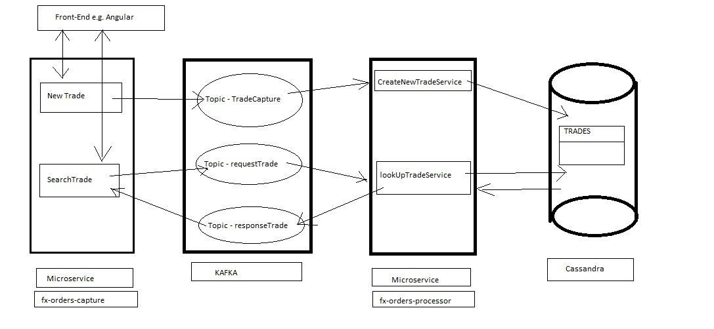
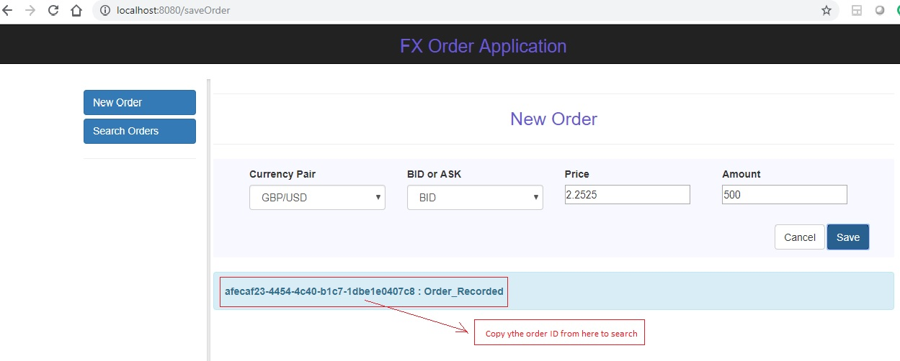
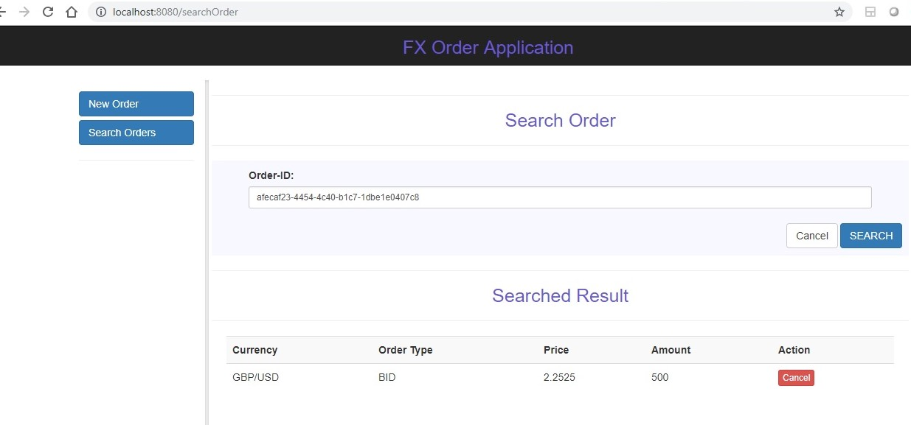

# fx-orders-capture - Overview

This is part of a data service project that uses java spring microservice (fx-orders-capture), kafka, cassandra to capture a hypothetical forex trade and publishes it to kafka topic (tradeCapture) and awaits for an acknowledgement for upto 5 seconds. There is another microservice (fx-orders-processor) that process the trade and inserts into a cassandra table (orders) under keyspace traderecords. 

We also have a search operation where an user can search a trade by using the order ID. As soon an user enters order ID in the search area and press enter the microservice (fx-orders-capture) publishes that order to kafka topic and awaits for a response upto 5 seconds before a time out response is returned back to front end. The other microservice (fx-orders-processor) retrieves that search ID from the request topic (tradeRequest) and retrieves the trade from cassandra table (orders) and publishes that trade to response topic (tradeReply). The requesting microdervice (fx-orders-capture) than picks that response and returns back to front end and display it.

We would be using spring boot thymeleaf for the front-end part to make this project simpler but it may have been better to use angular of react as well. 

# This microservice (fx-orders-capture) is responsible for 

* to capture an order and publish in to kafka topic (tradeCapture) and get an acknowledgement
* to get a order ID to publish it to kafka topic (tradeRequest) 
* retrive a response from kafka topic (tradeReply) and display it to front end

## Overall architecture
[]

## Basic configuration

This sample application shows how 

## Start Zookeeper
Download zookeeper from http://zookeeper.apache.org/releases.html#download and extract it to local drive. Rename “zoo_sample.cfg” to “zoo.cfg”. Also edit dataDir inside zoo.cfg to a valid path e.g. \zookeeper\data
Ensure you have java installed and JAVA_HOME is set in the system environment variable. Also add ZOOKEEPER_HOME environment variable upto bin path of your zookeeper directory and add ;%ZOOKEEPER_HOME%\bin; to PATH variable.

- `double click bin/zkServer.cmd` (windows)
- `bin/zookeeper-server-start.sh config/zookeeper.properties` (UNIX)

## Start Kafka Server
- `bin/kafka-server-start.sh config/server.properties`

## Create Kafka Topic
- `bin/kafka-topics.sh --create --zookeeper localhost:2181 --replication-factor 1 --partitions 1 --topic Kafka_Example`

## Start Cassandra
- `bin/kafka-console-consumer.sh --bootstrap-server localhost:9092 --topic Kafka_Example --from-beginning`

JUnit Test
------------------

If you have git-bash installed and configured in the path then use below command to checkout source code into your system,

git clone https://github.com/pmjobsearch01/fx-orders.git

If you have maven installed and in the path then use below command to build and run junit test cases that proves the core functions,

- Go to the folder where the code is checked-out (you should see the pom.xml in your current folder)

cd fx-orders

mvn clean install

Run Application
--------------------------
mvn spring-boot:run

Test from Browser (GUI)
-------------------------
Once application is up and running by using above run command then open a browser and test the application using below url

http://localhost:8080/

[]

[]
